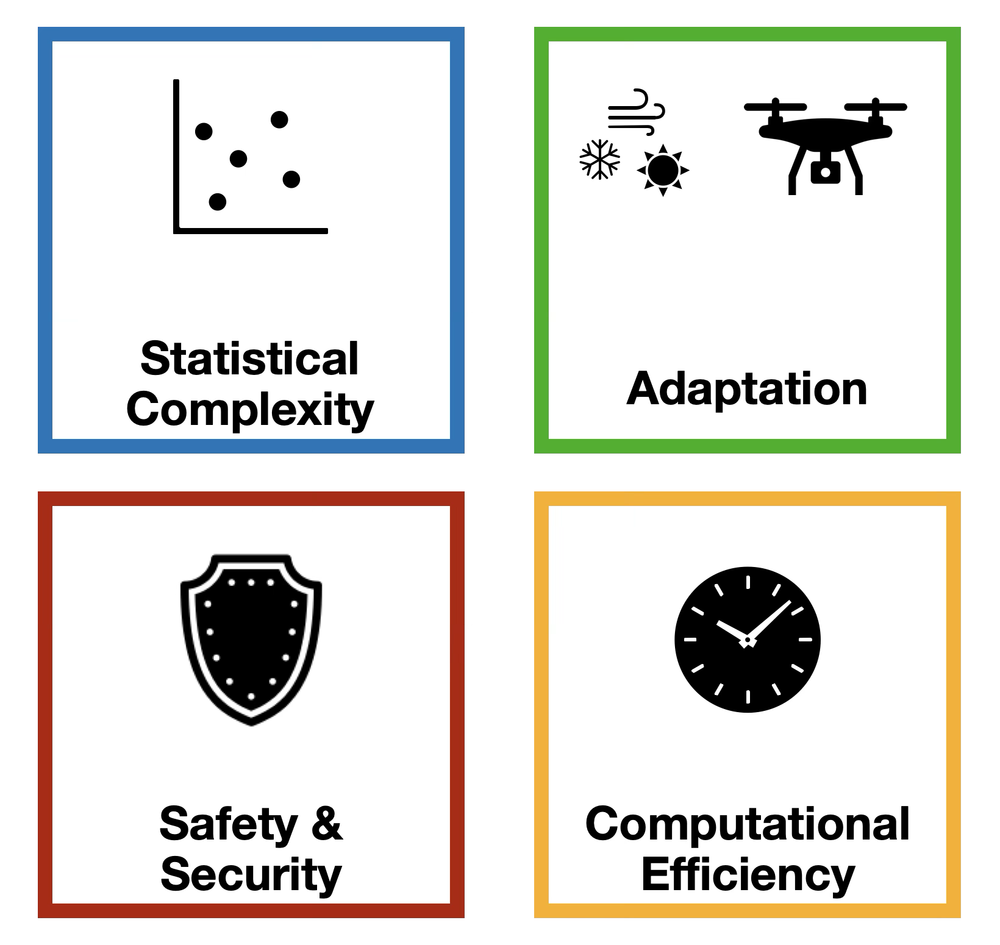

I am a Senior Scientist in the Automatic Control Laboratory at ETH Zürich, hosted by John Lygeros. Previously, I obtained my Ph.D. in the Electrical and Systems Engineering department at the University of Pennsylvania working with prof. George Pappas. I was a graduate research assistant with prof. Petros Maragos in Computer Vision, Speech Communication and Signal Processing Group at National Technical University of Athens (NTUA). I did my undergraduate thesis and research with prof. Kostas J. Kyriakopoulos in Control Systems Laboratory at NTUA. I received the diploma in Electrical and Computer Engineering at NTUA.

Research Interests
======
Control Theory, Learning-based Control, Statistical Learning Theory, Online Learning and Optimization, Robust Control, Risk-Sensitive Control

Research Overview
======
My current research lies in the intersection of control theory and machine learning. Learning-based control emerges as a promising solution for modern control applications, where adaptation to complex and unknown environments is required. Despite recent progress, we still do not fully understand the impact and limitations of learning algorithms on even simple control systems. My goal is to understand these limitations and develop algorithms that are efficient and safe.

<figure>
    
    <figcaption> Research Agenda.</figcaption>
</figure>
  
One of the main challenges in control systems is that closed-loop data are scarce. Hence, understanding the data requirements, that is, the **statistical complexity**, is essential. I am interested in understanding what makes learning easy (few samples are enough) or hard (many samples are necessary). How do system properties affect the statistical complexity? When is an algorithms statistically optimal? To answer these questions, one can borrow tools from **statistical learning theory** and carefully apply them to the setting of control systems.

Another challenge is that the enviroment and system might be highly dynamic and change over time. In this case, **online adaptation** is necessary. and how system theoretic properties fundamentally affect the difficulty of learning in system identification, online estimation and control. In particular, I focus on the statistical difficulty of learning, which is captured by the sample complexity, namely the number of samples needed to achieve satisfactory identification/control performance. I am also interested in online and data-driven control.
